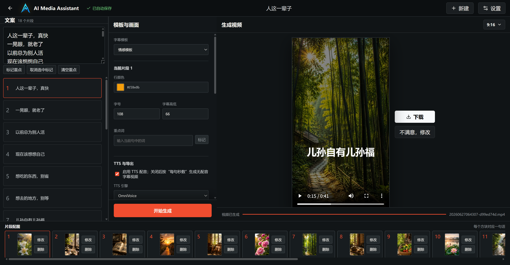

# AI Media Assistant Web
🎉 ai_caption_video 已正式升级为 AI Media Assistant！
为了支持更多 AI 创作能力，项目正式更名。
如果你以前听说的是 ai_caption_video，
你没有找错，这就是同一个项目。
<p align="right">

简体中文 | [English](readme.eng.md)

</p>

AI Media Assistant 是一款面向中文内容创作者的本地短视频生成工具。它在浏览器中完成文案编辑、字幕模板、逐句配图、配音、BGM 和视频导出，所有项目数据和生成结果默认保存在本机。

服务默认只监听 `127.0.0.1`，适合个人电脑本地使用。

# UI及输出成果展示
<p align="center">
  
</p>

https://github.com/user-attachments/assets/1332d442-f919-4064-ad73-bb960943f4ea

https://github.com/user-attachments/assets/c6010d8a-5c08-4af2-81dc-150750757820


观看 B 站视频演示:
https://www.bilibili.com/video/BV1kgKD6FEgB
  
## 主要能力

- 本地 Web 编辑器：项目创建、打开、复制、删除和自动保存。
- 多行文案管理：每一行文案都是独立片段，并使用 UUID 保存配图、颜色、音频等关联数据。
- 字幕模板：支持居中大字、滚动队列、古风模板和情感模板。
- 情感模板自动配图：根据每行文案匹配本地背景图库，已匹配图片在同一项目中不会重复使用。
- 逐句配图轨道：每一句可上传、修改或删除背景图。
- 重点词标记：支持选中文案后标记重点，并在字幕中高亮。
- 后端统一预览：浏览器预览和最终导出共享同一套字幕排版与画面裁切逻辑。
- TTS 配音：支持 OmniVoice、Qwen3-TTS、参考音频、预设语音和语速控制。
- BGM：支持内置音乐库、随机选曲、上传 BGM 和音量调整。
- 后台任务：TTS 和视频渲染由 Worker 执行，不阻塞 API 请求。
- 任务控制：支持任务状态显示、取消、重试和生成后视频预览/下载。
- 本地资源：支持内置背景图、预设音色、BGM、Logo 和模板索引。

## 技术结构

```text
apps/
  web/                 React + TypeScript + Vite 前端
  api/                 FastAPI + SQLAlchemy + Alembic 后端
workers/
  render_worker/       TTS 与视频渲染后台任务进程
packages/
  media_core/          字幕排版、模板、TTS 桥接、音视频合成核心
storage/
  resources/           可分发本地素材
  projects/            SQLite 数据库与 TTS 缓存
  uploads/             用户上传素材
  outputs/             导出视频
```

## Release 使用

下载 Release zip 后解压。

Windows 用户首次运行请在项目目录打开 PowerShell：

```powershell
powershell -ExecutionPolicy Bypass -File scripts\setup_windows.ps1
```

以后启动：

```powershell
powershell -ExecutionPolicy Bypass -File scripts\start_windows.ps1
```

打开：

```text
http://127.0.0.1:8123
```

macOS 用户首次运行请在项目目录打开 Terminal：

```bash
chmod +x scripts/setup_macos.sh scripts/start_macos.sh
./scripts/setup_macos.sh
```

以后启动：

```bash
./scripts/start_macos.sh
```

打开：

```text
http://127.0.0.1:8123
```

完整使用说明见：[docs/USER_GUIDE.md](docs/USER_GUIDE.md)。

## 依赖要求

- Windows 10/11 或 macOS
- Python 3.11+
- Node.js 20+
- FFmpeg，建议加入系统 PATH
- 可选：OmniVoice / Qwen3-TTS 模型环境

macOS 注意：系统自带的 Python 可能是 3.9，不能用于本项目。请安装 Python 3.11+，例如到 [Python 官网](https://www.python.org/downloads/macos/) 安装 Python 3.12，或使用 Homebrew 运行 `brew install python@3.12`。

模型权重不包含在仓库和 Release 包中，需要用户自行准备。右上角“设置”中可以配置模型位置。

模型目录建议放在软件根目录的 `models` 文件夹中：

```text
ai-media-assistant/
  models/
    OmniVoice/
      .venv/bin/python             macOS
      .venv/Scripts/python.exe     Windows
      omnivoice/
      ...
    Qwen3-TTS-1.7B/
      .venv/bin/python             macOS
      conda_env/python.exe         Windows
      Qwen/
      qwen_tts/
      ...
```

Windows 和 macOS 的模型运行环境不能混用。Windows 模型包里的 `python.exe`、`.dll`、`.pyd` 不能在 macOS 上执行；Mac 用户需要使用 macOS arm64 版模型包。维护者可在 Mac 上运行 `scripts/macos_models/build_all_macos.sh` 制作 `dist/OmniVoice-macos-arm64.zip`、`dist/Qwen3-TTS-1.7B-macos-arm64.zip` 和一个合包。

## 本地资源

Release 包可以包含这些可分发资源：

```text
storage/resources/
  ancient/                     古风参考资源
  bg_B-Roll_Senior_Emotions/   情感模板背景图
  bg_elder_person/             老年人背景图
  bgm_library/                 内置 BGM
  fonts/                       可分发字体
  voice/                       预设语音
```

以下内容属于运行产物，不应提交 Git，也不应打进公开源码：

```text
storage/projects/              SQLite 数据库与 TTS 缓存
storage/uploads/               用户上传素材
storage/outputs/               导出视频
.venv/
node_modules/
models/
```

## 本地开发

首次安装请先按系统运行对应 setup 脚本。之后常用开发命令在 Windows 和 macOS 下相同：

```bash
npm run dev
```

开发模式会同时启动：

- Web：`http://127.0.0.1:5173`
- API 文档：`http://127.0.0.1:8123/docs`
- 健康检查：`http://127.0.0.1:8123/api/health`
- Worker：后台消费 TTS 和视频渲染任务

构建前端后，可以由 FastAPI 直接托管 Web UI：

```bash
npm run build
npm run serve
```

打开：

```text
http://127.0.0.1:8123
```

## 测试

```bash
npm test
npm run build
```

## 打包 Release

维护者可运行：

```powershell
powershell -ExecutionPolicy Bypass -File scripts\package_release.ps1 -Version v2.0.0
```

默认输出：

```text
D:\Codex\outputs\ai-media-assistant.zip
```

打包脚本会包含已构建前端和可分发资源，并排除生成视频、上传文件、数据库、缓存、虚拟环境和依赖目录。
