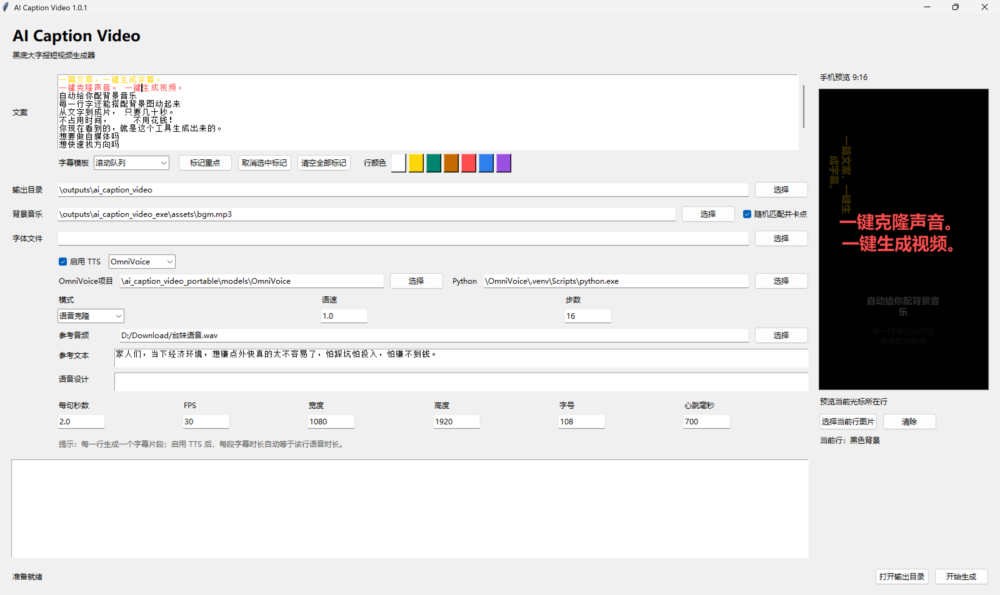
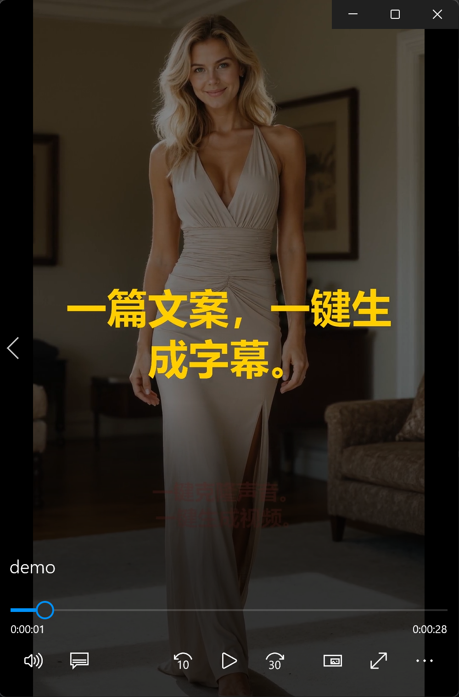

# ai_caption_video

一个面向中文短视频的“大字报/卡点字幕”生成工具。项目使用 Python、MoviePy、Pillow 和 FFmpeg 生成 9:16 黑底字幕视频，并支持本地 TTS 引擎按语音时长自动控制字幕片段。

## Preview



[Watch demo video](images/demo.mp4)

[](https://www.bilibili.com/video/BV1A9Ld6BEf8)


## Features

- 多行文案输入：每一行生成一个字幕片段
- 1080x1920 竖屏黑底视频
- 大号中文粗体字幕居中显示
- 9:16 phone-style live preview for the current line
- adjustable font size with real-time wrapping preview
- 选中文字标记重点，视频中显示黄色并带心跳动效
- per-line base color selection with keyword highlights preserved
- 每句可单独绑定背景图片，未配图时自动使用黑底
- 背景图片自动裁切为 9:16，并随机应用轻微推拉和平移运镜
- 随机字幕切换动画：缩小、滑出、竖起收起、倾斜缩小等
- rolling queue caption template: read text turns vertical, current text is enlarged, upcoming text waits below
- 可选背景音乐，自动裁剪到视频长度并降低音量
- 内置音乐库支持随机选曲，并让句间切换吸附到鼓点；连续生成时尽量避免重复曲目
- 可选 TTS：
  - Qwen3-TTS：支持预设人声、语音设计、语音克隆
  - OmniVoice：支持自动音色、语音设计、语音克隆和原生语速控制
- GUI 桌面界面
- PyInstaller 打包脚本

## Important

本仓库不包含任何 TTS 模型权重，也不分发生成的视频、音频、EXE 文件或用户配置。

如果使用 Qwen3-TTS、OmniVoice 或其他模型，请自行下载模型，并遵守对应项目和模型权重的许可证。

## Project Structure

```text
ai_caption_video/
  ai_caption_video/
    __init__.py
    __main__.py
    cli.py
    config.py
    font_utils.py
    gui.py
    music_library.py
    omnivoice_bridge.py
    renderer.py
    text_utils.py
    tts_bridge.py
    video_builder.py
  assets/
    .gitkeep
  output/
    .gitkeep
  build_exe.ps1
  gui_entry.py
  input.txt
  requirements.txt
```

## Requirements

- Windows is the primary tested platform
- Python 3.10+
- FFmpeg available in `PATH`
- A Chinese font installed on Windows, such as Microsoft YaHei

Install Python dependencies:

```powershell
cd D:\ai_caption_video
python -m venv .venv
.\.venv\Scripts\Activate.ps1
pip install -r requirements.txt
```

## Run CLI

```powershell
python -m ai_caption_video
```

Example:

```powershell
python -m ai_caption_video --input input.txt --output output/video.mp4 --keywords 人工智能,短视频,关键词
```

## Run GUI

```powershell
python gui_entry.py
```

The GUI supports:

- direct multiline script input
- selecting output directory
- marking highlighted text
- clearing all marks
- assigning or clearing a background image for the current line
- live image and caption composition preview
- random BGM selection and beat-synced sentence transitions
- Qwen3-TTS or OmniVoice engine selection
- Qwen3-TTS mode selection: preset voice, voice design, or voice clone
- OmniVoice mode selection: auto voice, voice design, or voice clone
- background music and custom font selection

Generated videos are named with timestamps, for example:

```text
20260616143022.mp4
```

## Qwen3-TTS

Qwen3-TTS is treated as an external local engine. The app calls the Python runtime inside the model project directory.

Default expected directory:

```text
\Qwen3-TTS-1.7B\Qwen3-TTS-1.7B
```

The app expects:

```text
\Qwen3-TTS-1.7B\Qwen3-TTS-1.7B\conda_env\python.exe
```

Supported Qwen modes:

- 预设人声：choose from Aiden, Dylan, Eric, Ono_anna, Ryan, Serena, Sohee, Uncle_fu, Vivian
- 语音设计：describe the desired voice, emotion, speaking style, and pace in natural language
- 语音克隆：upload reference audio and provide the exact reference text; x-vector only mode is available but quality may be lower

The Qwen engine runs through a persistent background worker while the GUI is open, so the first generation may be slow while the model loads, but later generations with an already loaded model are faster. Qwen speed control is intentionally not exposed because post-processing time stretch can introduce echo artifacts.

## OmniVoice

OmniVoice is treated as an external local engine. The GUI calls the Python runtime inside the OmniVoice project directory.

Default development location:

```text
D:\Codex\workspaces\OmniVoice
```

Portable package location:

```text
models\OmniVoice
```

The app expects:

```text
models\OmniVoice\.python\python.exe
models\OmniVoice\.venv
models\OmniVoice\hf_cache
```

Supported OmniVoice modes:

- 自动音色：generate with OmniVoice's automatic voice selection
- 语音设计：describe the desired voice, for example `female, natural, clear`
- 语音克隆：upload reference audio; reference text is optional because OmniVoice can auto-transcribe

OmniVoice supports native speed control. The GUI exposes `speed` and `num_step`.

## Build EXE

```powershell
.\build_exe.ps1
```

The build output is written outside the repository:

```text
\ai_caption_video_exe\ai_caption_video.exe
```

The EXE does not include TTS model weights.

## GitHub Release Suggestion

Do not commit generated EXE files to the repository. If you want to distribute Windows builds, upload the EXE under GitHub Releases instead.

## License

MIT License. See [LICENSE](LICENSE).
