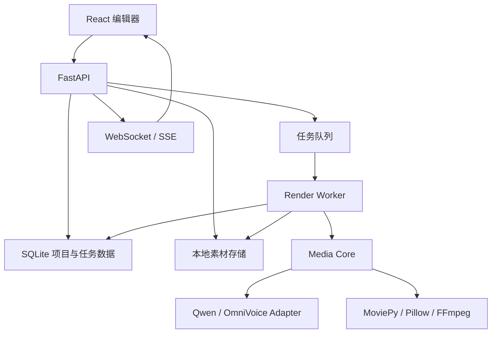

# AI Media Assistant 产品需求文档

| 项目 | 内容 |
| --- | --- |
| 产品名称 | AI Media Assistant |
| 文档版本 | v0.1 |
| 产品阶段 | Web MVP 规划 |
| 参考版本 | ai_caption_video v1.0.2 |
| 目标用户 | 中文短视频创作者、知识博主、自媒体运营者 |
| 推荐部署 | 本地 Web 应用优先，后续支持局域网和云端 |

## 1. 产品概述

AI Media Assistant 是一个面向中文短视频创作的媒体生产工作台。用户输入多行文案，系统按“每行一个镜头/字幕片段”建立时间轴，调用本地 TTS 生成配音，并自动生成与语音时长同步的 9:16 字幕视频。

Web 版不是简单把桌面 GUI 搬进浏览器，而是将文案、字幕、音色、图片、音乐、模板和导出任务统一为可保存、可恢复、可预览的项目。

### 1.1 核心价值

- 降低大字报、口播字幕视频的制作门槛。
- 让字幕时长自动跟随 TTS，而不是人工填写停留时间。
- 在生成前看到接近最终视频的排版、配图和颜色效果。
- 将本地大模型能力封装为普通创作者能理解的选项。
- 保留本地运行和隐私优势，避免上传用户音色和文案到第三方服务。

### 1.2 产品定位

MVP 聚焦“文案到字幕口播视频”，不是通用视频剪辑器。时间轴采用逐句结构，不在第一阶段提供任意轨道剪辑、关键帧编辑或复杂特效合成。

## 2. 目标与非目标

### 2.1 MVP 目标

1. 用户能在浏览器中创建、保存和重新打开项目。
2. 用户能输入多行文案，每一行形成独立片段。
3. 用户能标记重点词、设置行颜色、字号和字幕模板。
4. 用户能为每一句上传一张背景图片，也可保留模板默认背景。
5. 用户能选择 Qwen3-TTS 或 OmniVoice，并完成预设人声、语音设计或语音克隆。
6. 系统根据每句 TTS 音频时长自动生成字幕时间轴。
7. 用户能在 9:16 预览器中查看换行、颜色、图片和当前字幕状态。
8. 用户能选择或随机匹配 BGM，并导出不覆盖历史记录的 MP4。
9. 用户能看到任务进度、错误信息，并可取消或重试任务。

### 2.2 MVP 非目标

- 不提供多人实时协作。
- 不提供在线支付、套餐和计费。
- 不提供移动端完整编辑体验，移动端仅保证查看和基础操作。
- 不提供专业 NLE 式多轨时间轴。
- 不自动从互联网抓取版权不明的图片、音乐或字体。
- 不在首版部署公共云 GPU 服务。

## 3. 用户与场景

### 3.1 目标用户

**知识博主**：输入知识文案，使用大字报模板、重点词和稳定音色快速生成视频。

**故事/情绪类创作者**：使用语音克隆、逐句配图和 BGM 制作叙事视频。

**国风内容创作者**：使用古风模板、竖排毛笔字、朱砂重点词和动态烟雾生成国风视频。

**自媒体运营者**：批量尝试不同模板、音色和文案版本，保存历史输出。

### 3.2 核心使用流程


## 4. 信息架构

### 4.1 页面结构

1. **项目首页**
   - 新建项目
   - 最近项目
   - 项目复制、重命名、删除
   - 最近导出记录

2. **视频编辑器**
   - 左侧：文案与逐句设置
   - 中间：9:16 实时预览
   - 右侧：模板、字体、TTS、BGM 和导出设置
   - 底部：片段列表与任务状态

3. **素材管理**
   - 背景图片
   - 参考音频
   - BGM
   - 字体与授权提示

4. **任务中心**
   - TTS 任务
   - 渲染任务
   - 进度、日志、取消和重试

5. **系统设置**
   - 模型路径与状态
   - FFmpeg 状态
   - 默认输出目录
   - GPU/CPU 设备信息
   - 默认模板和音频参数

## 5. 功能需求

### 5.1 项目管理

| 编号 | 需求 | 优先级 | 验收标准 |
| --- | --- | --- | --- |
| P-001 | 创建空白项目 | P0 | 创建后进入编辑器，并生成唯一项目 ID |
| P-002 | 自动保存 | P0 | 编辑停止后 1 秒内保存，不依赖手动保存按钮 |
| P-003 | 打开历史项目 | P0 | 刷新浏览器或重启服务后可恢复文案和全部设置 |
| P-004 | 复制项目 | P1 | 复制文案和设置，生成新的项目 ID，不复用输出记录 |
| P-005 | 删除项目 | P1 | 二次确认后删除项目数据，可配置是否同时删除上传素材 |

### 5.2 文案编辑

| 编号 | 需求 | 优先级 | 验收标准 |
| --- | --- | --- | --- |
| S-001 | 多行文案输入 | P0 | 每个非空行生成一个片段，不依赖句号 |
| S-002 | 复制粘贴与撤销 | P0 | 支持常见快捷键和多行粘贴 |
| S-003 | 行增删与重排 | P0 | 删除行后对应颜色、标记、图片和音频关联一并删除 |
| S-004 | 重点词标记 | P0 | 可标记选中文字、单独取消或一键清空全部标记 |
| S-005 | 行颜色 | P0 | 每句可独立选择颜色；古风模板隐藏此设置 |
| S-006 | 稳定片段标识 | P0 | 行使用 UUID，不使用数组下标保存样式，避免新文案继承旧行数据 |

### 5.3 字幕与模板

#### 5.3.1 通用字幕设置

- 输出比例默认 9:16，默认分辨率 1080x1920。
- 支持字号、字体、FPS 和背景颜色。
- 文字换行在动画前计算，动画缩放不得重新触发换行。
- 入场动画结束后普通文字保持稳定。
- 重点词心跳仅改变字形渲染比例，不改变行框、行距和整体布局。
- 心跳间隔使用毫秒，默认 700ms，并保存在项目或用户设置中。

#### 5.3.2 模板列表

**滚动队列**

- 已读文字向上移动或竖起。
- 当前句放大并保持视觉焦点。
- 未读文字在下方排队。
- 片段切换与语音时长同步。

**居中大字**

- 黑底或图片背景。
- 当前句居中显示。
- 随机使用缩小、滑出、竖起、倾斜等过场。
- 上一句在下一句进入时快速缩小或移出。

**古风模板**

- 默认水墨背景和竖排毛笔字体。
- 文字从上到下逐字出现，每列最多 7 个中文字。
- 长句从右向左增加新列。
- 短句自动放大填充文字区域，长句自动缩小。
- 普通文字为墨黑色，重点文字为朱砂红。
- 标点不绘制，但参与逐字节奏和停顿计算。
- 动态烟雾贯穿整条视频，位于背景之上、文字之下，跨片段连续。
- 切换模板时联动 OmniVoice 语音克隆和默认古风参考音色（资源存在时）。

### 5.4 9:16 实时预览

| 编号 | 需求 | 优先级 | 验收标准 |
| --- | --- | --- | --- |
| V-001 | 手机比例预览 | P0 | 编辑器始终提供固定 9:16 画布，不因侧栏变化而变形 |
| V-002 | 排版预览 | P0 | 修改文案、字号、字体、颜色后 300ms 内更新 |
| V-003 | 图片预览 | P0 | 当前句图片按最终裁切规则显示 |
| V-004 | 动效预览 | P1 | 可播放当前片段低分辨率预览，包含字幕和烟雾动效 |
| V-005 | 预览/导出一致 | P0 | 前端使用后端返回的布局数据，避免前端自行猜测换行 |

### 5.5 逐句配图

- 每一句最多绑定一张图片，未上传时使用模板默认背景。
- 支持 PNG、JPG、JPEG 和 WebP。
- 上传后生成缩略图和预览图，保留原图用于导出。
- 自动裁切到 9:16，支持用户调整主体位置。
- 随机运镜包含轻微放大、缩小、上下左右平移。
- 同一片段内运镜连续，不产生跳帧。
- 删除句子后清理图片关联；实际文件可延迟清理，避免误删正在复用的素材。

### 5.6 TTS

#### 5.6.1 通用行为

- TTS 按句生成独立音频，便于失败重试和时长计算。
- 首次加载模型时显示明确状态，不弹出外部终端窗口。
- 服务运行期间复用常驻模型进程，避免每句重复加载。
- 每句音频生成后记录真实时长，字幕片段时长由音频决定。
- 支持试听单句、重新生成单句和重新生成全部。
- 参考音频上传后提供音量检测；音量偏小时允许无损增益或响度标准化。

#### 5.6.2 Qwen3-TTS

- 默认支持预设人声、语音设计和语音克隆。
- 预设人声使用下拉列表。
- 语音设计提供多行风格指令输入框和示例提示。
- 语音克隆提供参考音频与参考文本。
- 不在 MVP 暴露后期语速变速，避免回响和音质下降。

#### 5.6.3 OmniVoice

- 支持自动音色、语音设计和语音克隆。
- 支持原生 `speed` 与 `num_step` 参数。
- 古风模板可联动内置参考音色和参考文本。

#### 5.6.4 模型切换

- 选择不同模型时只显示该模型需要的字段。
- 切换模型不删除另一模型已保存的配置。
- 系统设置页显示模型路径、可用性、设备和加载状态。

### 5.7 BGM 与卡点

- 支持手动上传或选择 BGM。
- 支持从内置音乐库随机匹配，避免伪装成“智能匹配”。
- 音乐文件可携带 BPM 元数据或从文件名读取 BPM。
- 根据句间边界微调片段停留时间，使切换尽量贴近鼓点。
- 不允许卡点调整破坏 TTS 完整播放。
- BGM 自动裁剪到视频总长度，默认音量 30%。
- 后续版本可加入节拍检测和根据说话能量匹配音乐段落。

### 5.8 视频生成与输出

- 默认导出 H.264 MP4，1080x1920，30 FPS，AAC 音频。
- 输出文件名格式为 `yyyyMMddHHmmss.mp4`，不覆盖历史文件。
- 渲染任务进入后台队列，通过 WebSocket 或 SSE 推送进度。
- 任务状态：等待、TTS 生成、素材预处理、渲染、合成音频、完成、失败、已取消。
- 完成后提供浏览器播放、下载和打开本地目录。
- 失败时展示面向用户的错误摘要，并保留可展开的技术日志。

## 6. 数据模型

### 6.1 Project

```text
id: UUID
name: string
created_at: datetime
updated_at: datetime
canvas: CanvasSettings
template_id: string
tts_settings: TTSSettings
bgm_settings: BGMSettings
segments: Segment[]
```

### 6.2 Segment

```text
id: UUID
order: integer
text: string
marks: TextMark[]
text_color: RGBA | null
background_asset_id: UUID | null
background_motion: string | null
tts_audio_asset_id: UUID | null
audio_duration_ms: integer | null
status: draft | audio_ready | ready | error
```

### 6.3 TextMark

重点词不能只依赖字符下标长期保存。MVP 可保存 `start`、`end` 和选中文本，并在文本变更时执行校验；后续可升级为基于富文本节点的稳定标记。

```text
start: integer
end: integer
text: string
kind: highlight
```

### 6.4 Asset

```text
id: UUID
kind: image | reference_audio | narration | bgm | video
original_name: string
storage_path: string
mime_type: string
size: integer
duration_ms: integer | null
sha256: string
created_at: datetime
```

### 6.5 Job

```text
id: UUID
project_id: UUID
type: tts_segment | tts_all | preview | render
status: queued | running | succeeded | failed | cancelled
progress: number
stage: string
error_code: string | null
error_message: string | null
created_at: datetime
started_at: datetime | null
finished_at: datetime | null
```

## 7. API 草案

### 7.1 项目

```text
POST   /api/projects
GET    /api/projects
GET    /api/projects/{project_id}
PATCH  /api/projects/{project_id}
DELETE /api/projects/{project_id}
POST   /api/projects/{project_id}/duplicate
```

### 7.2 片段

```text
POST   /api/projects/{project_id}/segments
PATCH  /api/projects/{project_id}/segments/{segment_id}
DELETE /api/projects/{project_id}/segments/{segment_id}
POST   /api/projects/{project_id}/segments/reorder
```

### 7.3 素材与预览

```text
POST   /api/assets
DELETE /api/assets/{asset_id}
POST   /api/projects/{project_id}/layout
POST   /api/projects/{project_id}/preview
GET    /api/previews/{preview_id}
```

### 7.4 TTS 与任务

```text
GET    /api/models/status
POST   /api/projects/{project_id}/tts/segments/{segment_id}
POST   /api/projects/{project_id}/tts/all
POST   /api/projects/{project_id}/render
GET    /api/jobs/{job_id}
POST   /api/jobs/{job_id}/cancel
POST   /api/jobs/{job_id}/retry
GET    /api/events
```

## 8. 技术架构建议

### 8.1 推荐技术栈

| 层级 | 推荐方案 | 原因 |
| --- | --- | --- |
| 前端 | React + TypeScript + Vite | 适合高交互编辑器和实时预览 |
| UI 状态 | Zustand | 项目编辑状态简单直接，减少样板代码 |
| 服务端状态 | TanStack Query | 管理保存、任务和素材请求 |
| 后端 | FastAPI + Pydantic | 与现有 Python 媒体代码兼容，API 类型清晰 |
| 数据库 | SQLite（MVP） | 本地部署零配置，后续可迁移 PostgreSQL |
| ORM | SQLAlchemy + Alembic | 支持迁移和后续数据库替换 |
| 后台任务 | 独立 Python Worker + SQLite 队列（MVP） | 不强制用户安装 Redis，进程边界清晰 |
| 进度推送 | WebSocket 或 SSE | 实时显示 TTS 和渲染进度 |
| 媒体处理 | Pillow + MoviePy + FFmpeg | 复用现有渲染能力 |
| TTS | Qwen3-TTS + OmniVoice Adapter | 用统一接口隔离模型差异 |

### 8.2 服务边界



### 8.3 核心代码迁移原则

- 从旧项目迁移 `renderer.py`、`video_builder.py`、TTS bridge 和音乐逻辑时，先补充数据模型与测试，再移动代码。
- `media_core` 不依赖 FastAPI、React 或桌面 GUI。
- 所有模板实现统一接口：布局、静态预览、视频帧渲染、所需资源和可配置字段。
- TTS 模型通过 Adapter 接口接入，API 层不直接调用具体模型脚本。
- 前端不复制 Pillow 的换行算法；后端返回布局框和字形信息用于预览。

## 9. 非功能需求

### 9.1 性能

- 文案和样式修改后的静态预览响应目标小于 300ms。
- 单句 TTS 请求不重复加载已驻留模型。
- 预览使用 540x960 或更低代理分辨率，最终导出使用目标分辨率。
- 同一 GPU 默认只运行一个 TTS/渲染重任务，避免显存溢出。

### 9.2 稳定性

- 浏览器刷新不影响正在运行的后台任务。
- Worker 异常退出后，运行中任务在重启时标记为可重试。
- 上传文件使用哈希和唯一文件名，避免重名覆盖。
- 项目保存使用事务，避免写入一半导致项目损坏。

### 9.3 安全与隐私

- 默认仅监听 `127.0.0.1`。
- 参考音色、文案和输出文件只保存在本地。
- 若开放局域网访问，必须增加访问令牌和上传大小限制。
- 禁止将用户提供的文件名直接拼接为磁盘路径。
- 模型、字体、音乐和素材必须展示许可证与分发提示。

### 9.4 兼容性

- 首要支持 Windows 10/11 和 Chromium 内核浏览器。
- 后端路径处理不得假设英文目录，但建议模型目录使用稳定路径。
- 检测 FFmpeg、模型 Python 环境、CUDA 和显存，并提供可读诊断结果。

## 10. 异常与提示

- 模型未安装：展示检测路径和修复说明，不显示 Python Traceback 作为主提示。
- 参考音频缺失：阻止语音克隆任务，并定位到对应字段。
- 参考音频音量过低：提示响度标准化选项。
- 显存不足：建议关闭其他模型、降低并发或切换 CPU（模型支持时）。
- FFmpeg 缺失：系统设置页标红，并禁止开始最终渲染。
- 上传格式不支持：上传阶段立即拒绝并说明允许格式。
- 渲染失败：保留日志、项目和已生成的中间音频，允许重试。

## 11. MVP 验收场景

### 场景 A：普通知识视频

1. 输入 5 行文案。
2. 标记至少 2 个重点词。
3. 为其中 3 句设置不同图片。
4. 选择滚动队列模板和 Qwen 预设人声。
5. 生成语音并导出视频。
6. 验收：字幕时长跟随语音，重点词心跳不改变行距，图片与句子对应。

### 场景 B：语音克隆

1. 选择 OmniVoice 语音克隆。
2. 上传参考音频并填写参考文本。
3. 生成单句试听后生成全部语音。
4. 验收：模型只在首次调用时加载，后续句子复用模型进程。

### 场景 C：古风模板

1. 输入包含长句和短句的文案。
2. 标记重点词。
3. 切换古风模板。
4. 验收：每列不超过 7 字、短句自动放大、重点词朱砂红、烟雾全片连续可见且不遮挡文字。

### 场景 D：数据隔离

1. 为多行设置颜色和图片。
2. 删除这些行并粘贴新文案。
3. 验收：新行使用新 UUID，不继承已删除行的颜色、标记或图片。

## 12. 版本路线图

### Phase 0：工程基础

- Monorepo 目录与开发脚本
- FastAPI、React、SQLite
- 项目 CRUD 和自动保存
- 媒体核心接口与基础测试

### Phase 1：Web MVP

- 多行文案和重点词标记
- 9:16 静态预览
- 三种字幕模板
- 逐句配图
- Qwen3-TTS 与 OmniVoice
- 本地 BGM 和随机卡点
- 后台渲染任务与 MP4 下载

### Phase 2：创作效率

- 单句试听和局部重生成
- 模板参数面板
- 图片主体位置调整
- 项目复制与版本记录
- 批量导出多个模板版本

### Phase 3：AI 媒体助手

- 根据句子语义推荐本地素材或生成配图提示词
- 自动识别说话节奏与音乐鼓点
- 文案改写、标题和封面建议
- 更多模板、动画和 TTS 模型插件

### Phase 4：可选云端版本

- 用户账号、对象存储和 PostgreSQL
- Redis/Celery 或云任务队列
- GPU Worker 池、配额和计费
- 团队协作与模板分享

## 13. 成功指标

MVP 阶段优先衡量完成度和稳定性：

- 新用户能在 10 分钟内完成第一条视频。
- 90% 的项目无需手工修改字幕时间。
- 普通编辑操作不阻塞浏览器界面。
- TTS 或渲染失败后，用户能根据提示自行重试。
- 同一项目关闭并重新打开后，全部逐句设置正确恢复。

## 14. 开发前待确认事项

1. Web MVP 是否仅供本机使用，还是第一版就需要局域网访问。
2. 是否继续同时支持 Qwen3-TTS 与 OmniVoice，或第一阶段只接 OmniVoice。
3. 现有商业字体、背景、音色和 BGM 是否允许随 Web 版分发。
4. 项目文件是否需要可导入/导出的单文件格式。
5. 是否要求 Windows 一键启动包，还是先提供开发环境启动方式。
